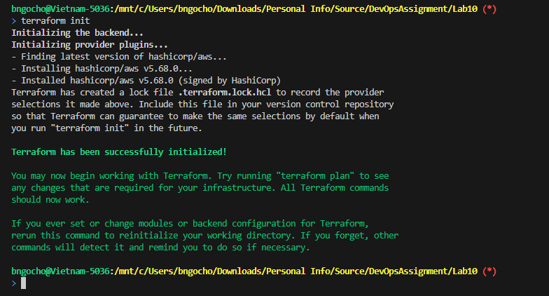
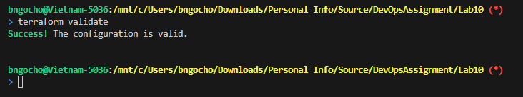

# Documentation for Lab10

## Teraform file to create VPC, Subnet, and Internet Gateway on AWS

### Initialize Terraform


### Validate the Configuration


### Then Plan and Apply the Deployment
```bash
terraform plan
```

```bash
terraform apply
```
