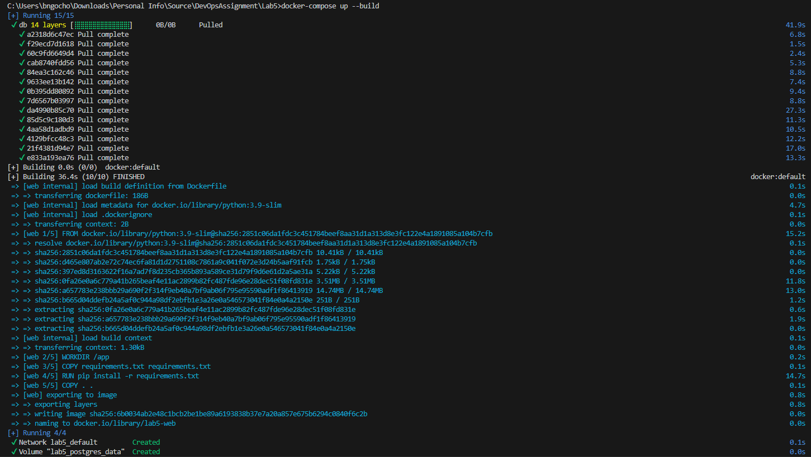
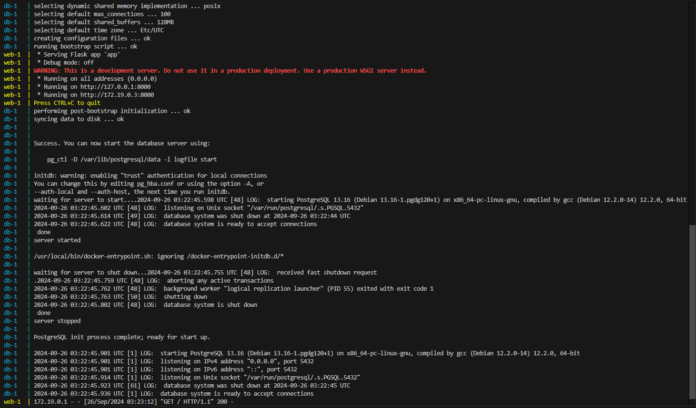
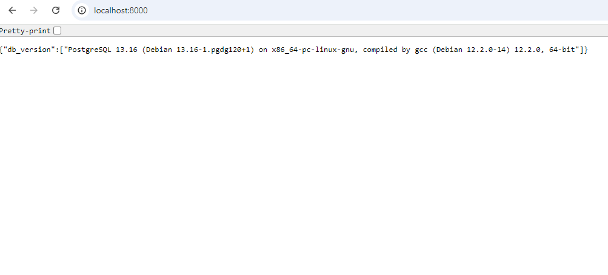
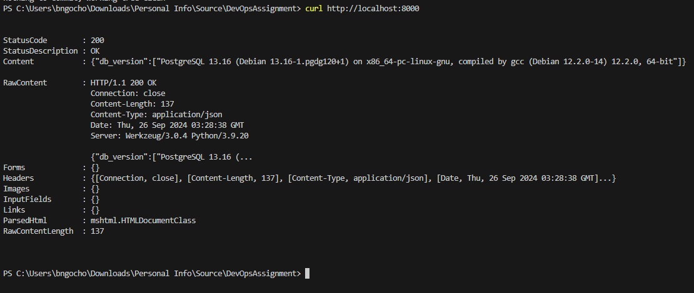

# Documentation for Lab5

## This Lab is a simple web application using Flask and connect it to a PostgreSQL database

### Use this command to run application
```cmd
docker-compose up --build

```





### Access the browser to verify that the data has been showed in UI



