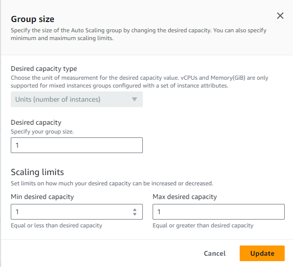
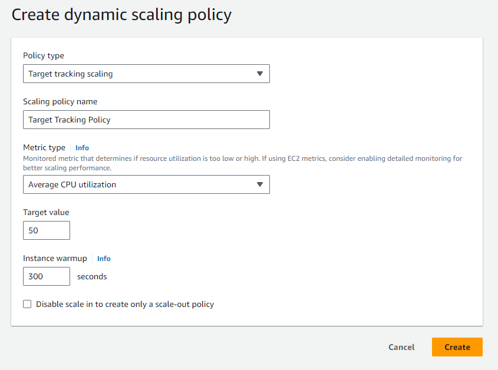

# Documentation for Lab8

## After we have instance nodegroup, we can create autoscaling group for it

## Define the group size

## Then create Dynamic scaling policies for it -> If CPU ultilization > 50 %, new instance will be create

